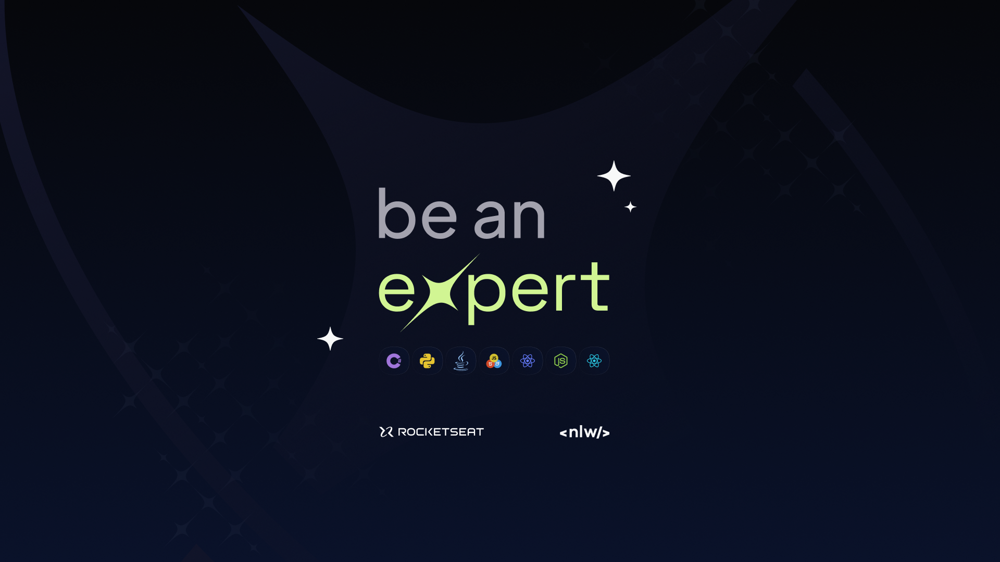

<h1 align="center"> #Nlw Expert </h1>

Programa exclusivo e gratuito, promovido pela Rocketseat para ensino de tecnologias WEB.

  <a href="#-tecnologias">Tecnologias</a>&nbsp;&nbsp;&nbsp;|&nbsp;&nbsp;&nbsp;
  <a href="#-projeto">Projeto</a>&nbsp;&nbsp;&nbsp;|&nbsp;&nbsp;&nbsp;
  <a href="#-layout">Layout</a>&nbsp;&nbsp;&nbsp;|&nbsp;&nbsp;&nbsp;
  <a href="#memo-licença">Licença</a>

  

 

  

## 🚀 Tecnologias

Esse projeto foi desenvolvido com as seguintes tecnologias:

- React
- Tailwind css
- Figma

## 💻 Projeto

Ao longo do curso, desenvolvemos uma aplicação front-end completa utilizando ReactJS, aplicando conceitos essenciais como Propriedades, Estados e Componentes, e ampliando ainda mais nossas habilidades com o uso de tipagem através do Typescript. Além disso, exploramos ferramentas poderosas como Vite para um ambiente de desenvolvimento ágil, e aprimoramos a interface com o uso responsivo do TailwindCSS.

- [Acesse o projeto finalizado, online](https://heitor-bello.github.io/ReactNotes/)

## 🔖 Layout

Você pode visualizar o layout do projeto através [DESSE LINK](<https://www.figma.com/community/file/1336456128647909148>). É necessário ter conta no [Figma](https://figma.com) para acessá-lo.

## :memo: Licença

Esse projeto está sob a licença MIT.

---

Feito com ♥ by Rocketseat :wave: [Participe da nossa comunidade!](https://discord.gg/rocketseat)
